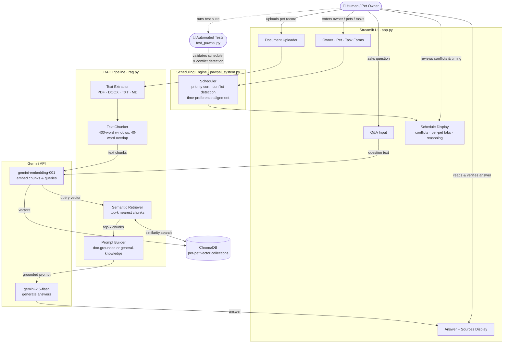

```mermaid
flowchart TD
    Human(["👤 Human / Pet Owner"])

    subgraph UI["Streamlit UI · app.py"]
        Forms["Owner · Pet · Task Forms"]
        DocUp["Document Uploader"]
        QAIn["Q&A Input"]
        SchedOut["Schedule Display\nconflicts · per-pet tabs · reasoning"]
        QAOut["Answer + Sources Display"]
    end

    subgraph Scheduler["Scheduling Engine · pawpal_system.py"]
        SchedLogic["Scheduler\npriority sort · conflict detection\ntime-preference alignment"]
    end

    subgraph RAG["RAG Pipeline · rag.py"]
        Extract["Text Extractor\nPDF · DOCX · TXT · MD"]
        Chunk["Text Chunker\n400-word windows, 40-word overlap"]
        Retrieve["Semantic Retriever\ntop-k nearest chunks"]
        PromptBuilder["Prompt Builder\ndoc-grounded or general-knowledge"]
    end

    Chroma[("ChromaDB\nper-pet vector collections")]

    subgraph Gemini["Gemini API"]
        Embed["gemini-embedding-001\nembed chunks & queries"]
        Gen["gemini-2.5-flash\ngenerate answers"]
    end

    Tests(["🧪 Automated Tests\ntest_pawpal.py"])

    %% Scheduling flow
    Human -->|"enters owner / pets / tasks"| Forms
    Forms --> SchedLogic
    SchedLogic --> SchedOut
    Human -->|"reviews conflicts & timing"| SchedOut

    %% Document ingestion flow
    Human -->|"uploads pet record"| DocUp
    DocUp --> Extract --> Chunk -->|"text chunks"| Embed
    Embed -->|"vectors"| Chroma

    %% Q&A flow
    Human -->|"asks question"| QAIn
    QAIn -->|"question text"| Embed
    Embed -->|"query vector"| Retrieve
    Retrieve <-->|"similarity search"| Chroma
    Retrieve -->|"top-k chunks"| PromptBuilder
    PromptBuilder -->|"grounded prompt"| Gen
    Gen -->|"answer"| QAOut
    Human -->|"reads & verifies answer"| QAOut

    %% Testing
    Tests -.->|"validates scheduler\n& conflict detection"| SchedLogic
    Human -.->|"runs test suite"| Tests
```